# AWSKRUG 데이터핸즈온 Part2

AWSKRUG #datascience 그룹의 두번째 핸즈온 시간은 Amazon Sagemaker를 이용한 머신러닝 모델 만들기 입니다.

## 목적
머신러닝을 이용하여 문제를 해결하는 프로세스를 이해하고, Amazon Sagemaker를 이용하여 모델을 학습시키고, 학습 한 모델을 예측시에 사용하여 예측해봅니다. 모델학습을 위해서 자신이 사용하는 머신러닝 프레임워크를 통해 학습한 모델을 직접 배포하는 예제를 실습합니다. 이번 실습에서는 R을 이용했고, 동일한 코드를 Python이나 다른언어로 변경이 가능합니다.

## AWS Resources 
AWS에서 사용하는 리소스는 다음과 같습니다.
- S3: 어디서나 원하는 양의 데이터를 저장하고 검색할 수 있도록 구축된 객체 스토리지. 생상한 모델의 저장소로 활용
- ECR: Docker 콘테이너 이미지를 손쉽게 저장, 관리 및 배포할 수 있게 해주는 완전관리형 Docker 콘테이너 레지스트리
- Amazon Sagemaker: 데이터과학자와 개발자 모두가 머신러닝을 이용한 모델을 쉽고 빠르게 만들고 프로덕션에 배포할 수 있도록 하는 완전 관리형 서비스

## 머신러닝 프로세스
아래 그림은 머신러닝을 이용하여 문제를 해결하고자 할 때 진행하는 작업들을 프로세스화 해놓은 내용입니다.


그림1. 머신러닝 프로세스

출처: https://www.slideshare.net/awskorea/amazon-sagemaker-awss-new-deep-learning-service-muhyun-kim

## Amazon Sagemaker
성공적인 머신러닝 프로젝트는 올바른 문제점 정의로 부터 시작됩니다. 그로부터 필요한 데이터를 수집하고, 가공하고, 분석하여 적합한 알고리즘 선택 및 평가를 반복적으로 수행하여 최적의 모델을 찾는 과정입니다. 또한 이렇게 많은 노력을 들여서 찾은 최적의 모델을 실제 운영중인 서비스에 어떻게 배포하고, 배포 이후에 유지보수에 대한 고민도 필요합니다. 이러한 과정속에서 작업자는 다양한 문제에 직면하게 되는데, Amazon Sagemaker는 이러한 머신러닝 프로세스의 이해를 바탕으로 많은 부분을 자동화 혹은 원클릭 관리형태의 편의를 제공합니다. 이로써 작업자는 재현가능하고, 확장가능한 머신러닝 주기를 Amazon Sagemaker를 통해서 진행하게 됩니다.

## 제품색상 분류 모델 만들기
### 배경 및 문제정의
여러분이 상품을 판매하는 커머스를 운영하고 있다고 가정해봅시다. 지난 기획회의를 통해서 상품을 색상별로 필터링 하는 기능을 제공하기로 하였습니다. 어떻게 하면 이 기능을 구현할 수 있을까요? 제일 먼저 떠오르는 쉬운 방법은 각 상품에 맞는 색상정보를 태그로 달아두면 될 것 같습니다. 하지만 만약 이미 보유중인 상품이 수십만개가 있고, 하루에도 신규로 등록되는 상품이 수백건에 이른다면 각 상품마다 색상정보를 확인하고 태그를 수작업으로 만들기에는 현실적으로 불가능한 작업입니다. 연속성을 가지고 있는 색상 정보는 RGB값으로 표현가능하지만, 여러분이라면 그림3 같은 예제에서 RGB값으로 파란색, 남색, 민트색을 어떻게 구분을 할 수 있을까요? 또한 파란색, 남색, 민트색이라는 분류 자체도 사람마다 기준이 다를 수 있다는 문제가 있습니다.

우리가 머신러닝을 통해서 기대하는 것은 이러한 색상정보를 바탕으로 학습시킨 색상 분류모델을 학습하고, 새로운 데이터를 해당 모델을 이용하여 색상을 분류해내는 것 입니다.


그림2. 제품 색상 카테고리를 이용한 필터


그림3. 파..란색?

### 데이터 수집/분석
#### 이미지 수집
환경 제약으로 상품이미지를 직접 제공하지 않고, 해당 이미지들로부터 추출 된 RGB값을 정리한 csv 파일을 제공합니다.

#### 이미지에서 대표생상 추출하기
이미지/영상 분석을 위해 많은 Vision API 서비스들이 존재합니다. 이번 핸즈온 세션에서는 상품이미지로부터 대표색상을 추출하기 위해 Google Vision API를 이용하였습니다. 이미지 분석 결과를 아래의 예제와 같이 JSON 형태로 제공하는데, 색상정보는 "imagePropertiesAnnotation":"dominantColors" 키 정보를 확인합니다. Google Vision API는 기본적인 이미지의 속성값들 이외에 이미지내에 텍스트 검출이나 사물 인식, 안면 인식 등 다양한 기능들을 제공합니다.

* Google Vision API: https://cloud.google.com/vision/
* Reference: [Google Vision API on AWS serverless Architecture](https://github.com/ramhiser/serverless-cloud-vision)


그림4. Google Vison API 서비스 결과

```
"imagePropertiesAnnotation": {
    "dominantColors": {
      "colors": [
        {
          "color": {
            "red": 142,
            "green": 117,
            "blue": 63
          },
          "score": 0.6612631,
          "pixelFraction": 0.12279835
        },
        {
          "color": {
            "red": 249,
            "green": 246,
            "blue": 238
          },
          "score": 0.006199196,
          "pixelFraction": 0.78886145
        },
        {
          "color": {
            "red": 168,
            "green": 141,
            "blue": 81
          },
          "score": 0.16880207,
          "pixelFraction": 0.0363786
        },
        {
          "color": {
            "red": 112,
            "green": 90,
            "blue": 43
          },
          "score": 0.08063871,
          "pixelFraction": 0.01048011
        },
        {
          "color": {
            "red": 100,
            "green": 83,
            "blue": 52
          },
          "score": 0.04571068,
          "pixelFraction": 0.008449932
        },
        {
          "color": {
            "red": 134,
            "green": 118,
            "blue": 83
          },
          "score": 0.01805886,
          "pixelFraction": 0.009437586
        },
        {
          "color": {
            "red": 167,
            "green": 153,
            "blue": 122
          },
          "score": 0.0074093975,
          "pixelFraction": 0.005925926
        },
        {
          "color": {
            "red": 248,
            "green": 242,
            "blue": 219
          },
          "score": 0.004106172,
          "pixelFraction": 0.010260631
        },
        {
          "color": {
            "red": 205,
            "green": 194,
            "blue": 170
          },
          "score": 0.0029049732,
          "pixelFraction": 0.0036213992
        },
        {
          "color": {
            "red": 72,
            "green": 59,
            "blue": 35
          },
          "score": 0.002403682,
          "pixelFraction": 0.00043895748
        }
      ]
    }
  },
```

### 모델링
#### Amazon Sagemaker 시작하기
Amazon Sagemaker는 아래와 같이 구성되어 있습니다.
  1. 대시보드
  1. 노트북
  1. 교육
  1. 추론

2018년 6월, Amazon Sagemaker가 서울 리전에 출시 되었습니다. 리전은 서울로 선택합니다.

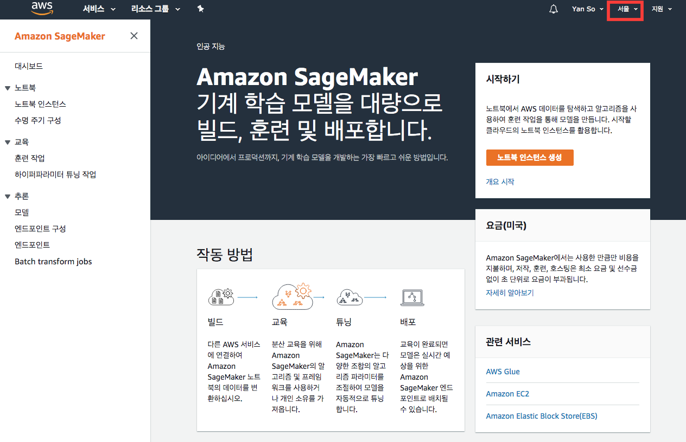

[그림5] Amazon Sagemaker 메인화면

Jupyter 노트북 인스턴스 생성하기
노트북 인스턴스를 생성합니다. 왼쪽 탭에 노트북 인스턴스 메뉴로 들어가서 노트북 인스턴스 생성 버튼을 클릭 합니다.

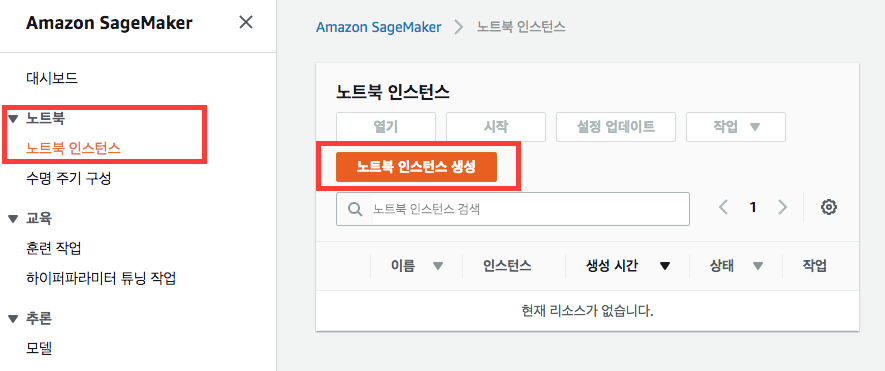

[그림6] 노트북 인스턴스 생성하기

런칭 할 노트북 인스턴스의 상세 설정이 가능합니다. 이번 세션에서는 모두 기본 값을 사용할 예정이지만, 향후에 자신의 연구나 현업에서 작업내용, 환경에 따라서 구성해주시면 됩니다. 노트북 인스턴스의 경우는 많은 컴퓨팅 파워가 필요하지 않습니다. 하지만 훈련을 위한 인스턴스, 특히 이미지 분석/학습을 위해서는 GPU 리소스를 사용하는것을 권장하는데, 이럴 경우에는 인스턴스 유형을 p2 시리즈로 선택합니다. (이번 핸즈온에서는 훈련을 위한 잡을 생성하진 않습니다)

아래와 같이 설정 후 노트북 인스턴스 생성 버튼을 클릭합니다.
  1. 노트북 인스턴스 이름을 {username}-hadnson-2 로 합니다.
  2. IAM 역할을 생성합니다. 생성 할 때 지정하는 S3 버킷 이름의 특정 S3 버킷을 없음으로 변경합니다.

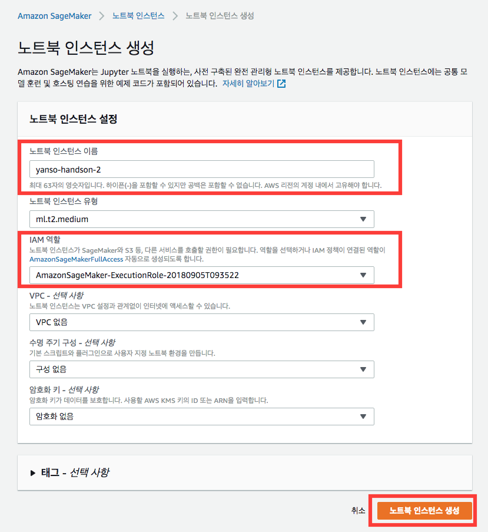

[그림7] 노트북 인스턴스 설정하기

노트북 인스턴스 생성까지 1-2분정도 시간이 걸립니다.

노트북이 생성되는 동안 IAM 메뉴에서 방금 생성된 Role에 ECR 권한을 추가합니다. Amazon Sagemaker 에서 학습/배포과정에서 작업환경을 Docker로 구성 및 ECR에 배포/관리 작업이 이루어집니다. 이때 행위의 주체는 여러분이 아닌 방금전 생성 된 Amazon Sagemaker Role 권한으로 수행됩니다. (명심!)

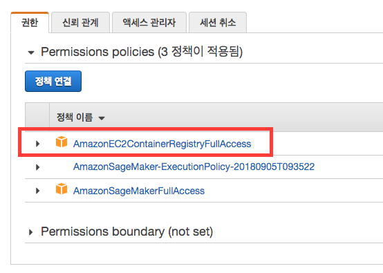

[그림8] ECR 정책 추가하기

노트북 인스턴스가 생성 완료되면, 이제부터 Jupyer Notebook 환경에서 작업을 시작합니다. 

#### R Kernel 설치하기
데이터 처리와 모델 학습을 R코드로 진행하였습니다. Juypter Notebook에서 R을 수행하기 위해서는 R Core 설치가 필요합니다.

SageMaker Examples 탭에 install_r_kernel.ipynb 노트북을 열어서 R Kernel 인스톨을 진행합니다. SameMaker Examples에는 Amazon Sagemaker를 이용한 다양한 활용 예제가 있으니 꼭 활용해 보세요.

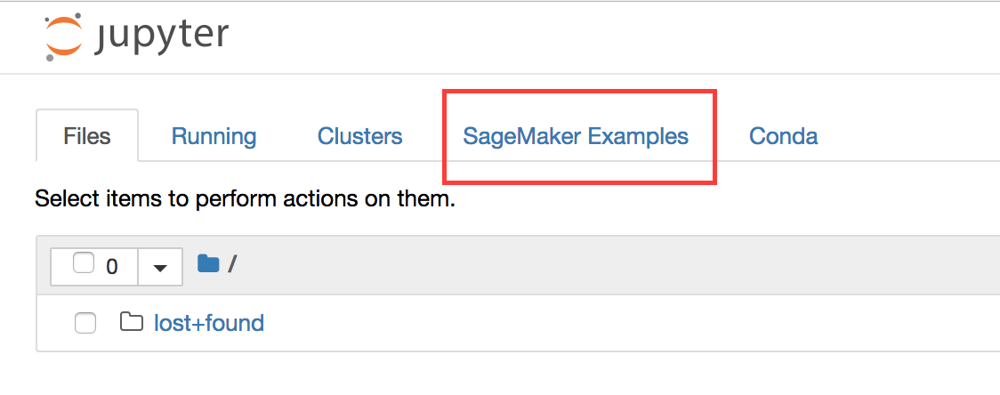

[그림9] R Kernel 설치하기1

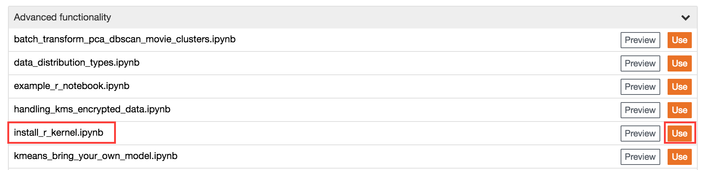

[그림10] R Kernel 설치하기2
해당 노트북의 코드블럭을 수행하면 R을 이용하기 위한 파일들을 다운받고 설치합니다. 설치완료까지 5분정도 소요 됩니다.
설치가 완료되면 첫 페이지인 대시보드로 돌아가서 페이지 리프레시를 해야합니다. 리프레시 후에 새로운 노트북을 생성을 시도해보면 설치 이전에 보이지 않던 R마크가 있는 노트북이 보입니다.

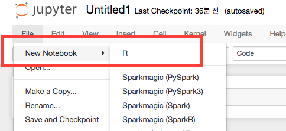

[그림11] R Kernel 설치하기3

#### 코드 저장소 체크아웃
새로운 터미널을 실행 소스코드를 생성합니다.

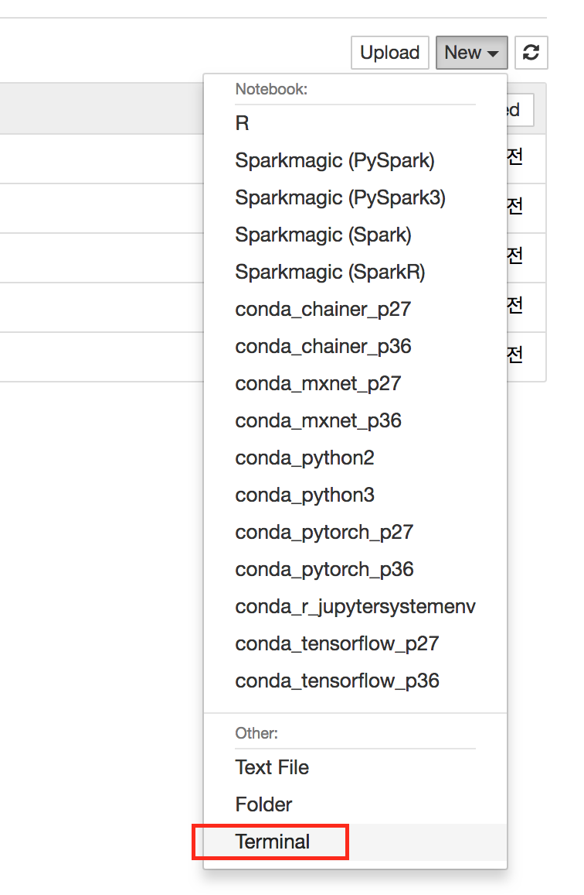

[그림12] 터미널 실행

실습을 위한 데이터와 노트북을 ~/Sagemaker 폴더 안에서 생성합니다.
```
cd ~/Sagemaker
git clone https://github.com/yansonz/2018-handson-data-02.git
```

#### R Package 설치하기
실습에 필요한 R Package 들을 설치합니다. 터미널 상에서 아래 명령을 수행합니다.
```
R -e "install.packages(c('aws.signature', 'aws.s3', 'tree', 'colorspace'), repos='https://cloud.r-project.org')"
```

#### Credentials 설정하기
수행 중간 산출물들을 S3에 업로드를 위해 AWS Credential 정보를 설정합니다. 체크아웃 받은 소스코드 폴더 내에 credentials 라는 파일을 만들고 아래와 같이 정보를 입력합니다.

```
[default]
aws_default_region = ap-northeast-2
 
[handson2]
aws_access_key_id = xxxx
aws_secret_access_key = yyyy
aws_default_region = ap-northeast-2
```

#### 모델 만들기
[r-model-classification-colour.ipynb](r-model-classification-colour.ipynb) 노트북을 열어서 코드 블록을 실행합니다.

#### 모델 개선하기
인간의 색 지각이 비선형이라는 연구 결과에 따라, Lab 색 공간은 실제 빛의 파장과 비선형적 관계를 갖습니다. 또한 Lab 공간에서 서로 다른 두 색의 거리는 인간이 느끼는 색깔의 차이와 비례하도록 설계되었다고 합니다. Lab 색상공간은 각각 

L: 밝기
a: 빨강-초록
b: 노랑-파랑

를 의미합니다. 기존에 RGB로 표현하여 학습한 모델이 Lab로 표현을 변환하여 학습시키면 인지적인 관점에서 분류한 색상 레이블들을 더 잘 분류할 수 있을 것이라는 가정을 가지고 다시 실험을 해보고자 합니다. 기존에 해왔던 작업을 되짚어보면 모델 학습 시 사용한 데이터를 재가공하여 Amazon Sagemaker 상에 구축해놓은 기존에 절차대로 작업을 진행하면 되겠습니다.

참고:
* [CIELAB 색상공간](https://ko.wikipedia.org/wiki/CIELAB_%EC%83%89_%EA%B3%B5%EA%B0%84)
* 색의 연속성 https://www.w3schools.com/colors/colors_picker.asp

RGB의 색상값을 Lab로 변경하기 위해 [r-model-classification-colour.ipynb](r-model-classification-colour.ipynb) 파일 내에 아래 주석처리를 해제후에 다시 모든 코드 블록을 수행합니다.
```
# col.type = "lab"
# lab = as(RGB(dat[, "R"]/255, dat[, "G"]/255, dat[, "B"]/255), "LAB")
# dat = as.data.frame(coords(lab))
# dat$LABEL = rgb$LABEL
```

### 모델 배포하기
1. [sm-classification-colour.ipynb](sm-classification-colour.ipynb) 노트북을 열어서 코드 블록을 실행합니다.
2. 배포하고 Endpoint 정보 확인하기

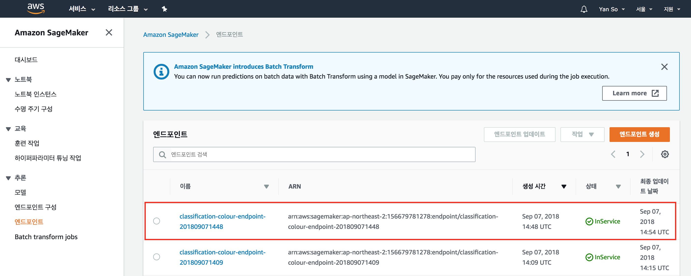

[그림13] 엔드포인트 생성 확인

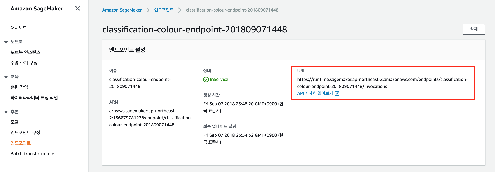

[그림14] 생성된 엔드포인트 정보

## 리소스 삭제하기
* 엔드포인트 삭제
* 엔드포인트 구성삭제
* 모델 삭제
* 노트북 인스턴스 삭제
* S3에서 생성한 "sagemaker-handson-2버킷을 삭제
* CloudWatch 콘솔에서 이름이 /aws/sagemaker/로 시작하는 모든 로그 그룹을 삭제
* IAM 콘솔에서 AmazonSageMaker-* 역할을 삭제

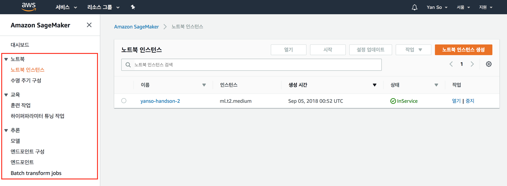

[그림15] Amazon Sagemaker 콘솔에서 리소스 삭제
